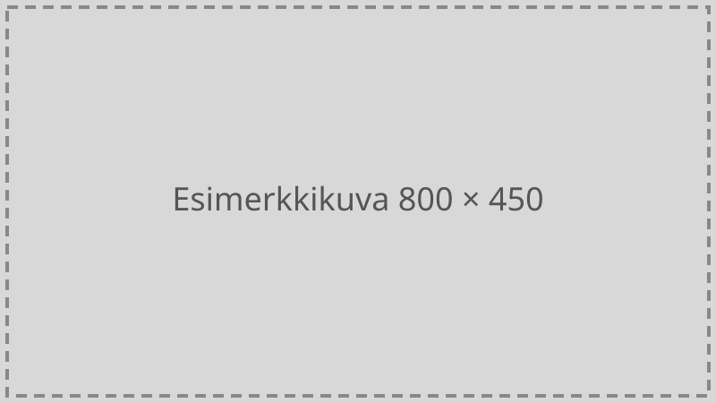

Tämä on esimerkkiartikkeli, jonka voi poistaa, kun oikeaa sisältöä on
olemassa. Se näyttää, miltä pitkä tekstimuotoinen julkaisu näyttää
sivustolla.

## Väliotsikko

Artikkelit kirjoitetaan Markdown-muodossa. Kappaleet erotetaan
tyhjällä rivillä, ja väliotsikot merkitään risuaidoilla. Kuvat voi
sijoittaa artikkelin omaan kansioon ja viitata niihin suhteellisella
polulla:

```markdown

```

Näin se näyttää käytännössä:


Listat toimivat myös:

- ensimmäinen kohta
- toinen kohta
- kolmas kohta

> Lainaukset merkitään suurempi kuin -merkillä rivin alkuun.

## Metatiedot

Artikkelin alussa olevassa etuaineistossa (front matter) määritellään
otsikko, kirjoittaja ja päivämäärä. Muunkielisille artikkeleille voi
lisätä `lang`-kentän, jolloin sivun kieliattribuutti vaihtuu.
